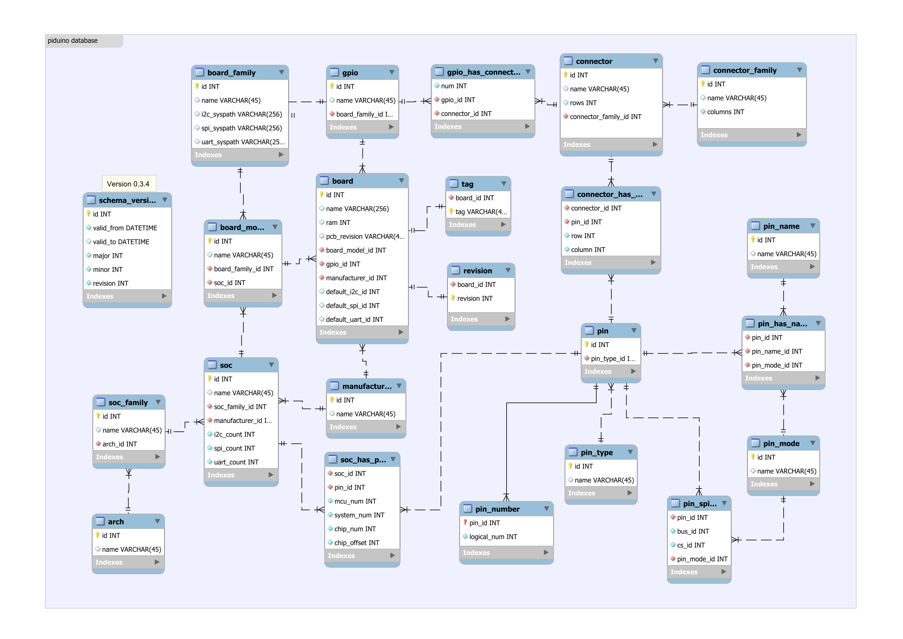

# piduino-database
  _Arduino on Pi boards, the best of both worlds !_
  
Piduino uses a relational database which ensures very good
data integrity and avoids redundancies.

|  |
|:--:|
| *Piduino Relational Database Model* |

**Work is in progress to add client software to manage the database...**

For now, it is possible to manage the database using a [sqlite3 client](https://sqlite.org/cli.html).

Examples of use cases are provided in the [piduino-db-use_cases.md](piduino-db-use_cases.md) file.

The condition to be able to add a board to the database is that **it uses one of the SoCs supported by Piduino**.

## List of SoCs supported on January 12, 2020.

| id | name    |
|----|---------|
| 0  | Bcm2708 |
| 1  | Bcm2709 |
| 2  | Bcm2710 |
| 5  | Bcm2711 |
| 3  | H3      |
| 4  | H5      |
