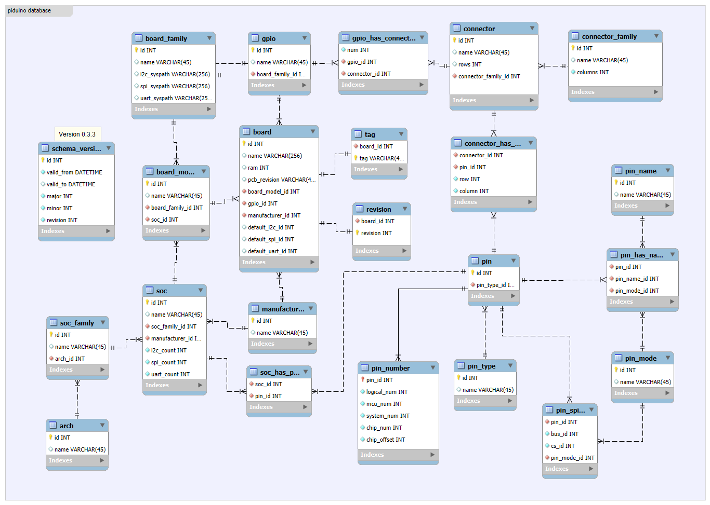

# PiDuino Database management use cases

Piduino uses a relational database which ensures very good
data integrity and avoids redundancies.

|    |
| :---------------------------------: |
| *Piduino Relational Database Model* |

## Addition of a new Raspberry Pi model with its variants (CM3+)

**TODO**

| Rev 0x | Rev      | Model | PCB Rev | RAM | Manufacturer |
| ------ | -------- | ----- | ------- | --- | ------------ |
| A02100 | 10494208 | CM3+  | 1.0     | 1GB | Sony UK      |

## Addition of a new Raspberry Pi model with its variants (4B)

| Rev 0x | Rev      | Model | PCB Rev | RAM | Manufacturer |
| ------ | -------- | ----- | ------- | --- | ------------ |
| A03111 | 10498321 | 4B    | 1.1     | 1GB | Sony UK(1)   |
| B03111 | 11546897 | 4B    | 1.1     | 2GB | Sony UK(1)   |
| C03111 | 12595473 | 4B    | 1.1     | 4GB | Sony UK(1)   |
| C03112 | 12595474 | 4B    | 1.2     | 4GB | Sony UK(1)   |

    -- (id,name,board_family_id,soc_id) 
    INSERT INTO "board_model" VALUES(23,'RaspberryPi 4B',0,5);

    -- (id,name,ram,pcb_revision,board_model_id,gpio_id,manufacturer_id,default_i2c_id,default_spi_id,default_uart_id) 
    INSERT INTO "board" VALUES(50,'RaspberryPi 4B (0xA03111)',1024,'1.1',23,3,1,1,0,0);
    INSERT INTO "board" VALUES(51,'RaspberryPi 4B (0xB03111)',2048,'1.1',23,3,1,1,0,0);
    INSERT INTO "board" VALUES(52,'RaspberryPi 4B (0xC03111)',4096,'1.1',23,3,1,1,0,0);
    INSERT INTO "board" VALUES(53,'RaspberryPi 4B (0xC03112)',4096,'1.2',23,3,1,1,0,0);

    -- (board_id,revision)
    INSERT INTO "revision" VALUES(50,10498321);
    INSERT INTO "revision" VALUES(51,11546897);
    INSERT INTO "revision" VALUES(52,12595473);
    INSERT INTO "revision" VALUES(53,12595474);


## Addition of Raspberry Pi variants of existing models


| Rev 0x | Rev      | Model             | PCB Rev | RAM   | Manufacturer |
| ------ | -------- | ----------------- | ------- | ----- | ------------ |
| A220A0 | 10625184 | CM3               | 1.0     | 1GB   | Embest(4)    |
| A22083 | 10625155 | 3B                | 1.3     | 1GB   | Embest(4)    |
| 900061 | 9437281  | CM                | 1.1     | 512MB | Sony UK      |
| A02042 | 10494018 | 2B (with BCM2837) | 1.2     | 1GB   | Sony UK      |


    -- (id,name,ram,pcb_revision,board_model_id,gpio_id,manufacturer_id,default_i2c_id,default_spi_id,default_uart_id) 
    INSERT INTO "board" VALUES(46,'RaspberryPi Compute Module 3 (0xA220A0)',1024,'1',9,3,4,1,0,0);
    INSERT INTO "board" VALUES(47,'RaspberryPi 3B (0xA22083)',1024,'1.3',7,3,4,1,0,0);
    INSERT INTO "board" VALUES(48,'RaspberryPi Compute Module (0x900061)',512,'1.1',4,3,1,1,0,0);
    INSERT INTO "board" VALUES(49,'RaspberryPi 2B (0xA02042)',1024,'1.2',5,3,1,1,0,0);

    -- (board_id,revision)
    INSERT INTO "revision" VALUES(46,10625184);
    INSERT INTO "revision" VALUES(47,10625155);
    INSERT INTO "revision" VALUES(48,9437281);
    INSERT INTO "revision" VALUES(49,10494018);

## Addition of manufacturer

Add manufacturer, existing card (30)

| Rev 0x | Rev      | Model | PCB Rev | RAM | Manufacturer  |
| ------ | -------- | ----- | ------- | --- | ------------- |
| A32082 | 10690690 | 3B    | 1.2     | 1GB | Sony Japan(8) |


    -- (id,name)
    INSERT INTO "manufacturer" VALUES(8,'Sony Japan');

    -- (id,name,ram,pcb_revision,board_model_id,gpio_id,manufacturer_id,default_i2c_id,default_spi_id,default_uart_id) 
    INSERT INTO "board" VALUES(30,'RaspberryPi 3B (0xA32082)',1024,'1.2',7,3,8,1,0,0);


## Add board with new GPIO and connectors (here NanoPi Duo2)


### New pin CVBS (Composite Video)

    -- (id,pin_type_id)
    INSERT INTO "pin" VALUES(98,4);

    -- (id,name)
    INSERT INTO "pin_name" VALUES(258,'CVBS');

    -- (pin_id,pin_name_id,pin_mode_id)
    INSERT INTO "pin_has_name" VALUES(98,258,0);

    -- (soc_id,pin_id)
    INSERT INTO "soc_has_pin" VALUES(3,98); -- H3
    INSERT INTO "soc_has_pin" VALUES(4,98); -- H5

### New connectors

    -- (id,name,rows,connector_family_id)
    INSERT INTO "connector" VALUES(17,'j1_j2',16,1);
    INSERT INTO "connector" VALUES(18,'inner',7,0);

    -- (connector_id,pin_id,row,column)
    INSERT INTO "connector_has_pin" VALUES(17,2,1,1);
    INSERT INTO "connector_has_pin" VALUES(17,53,1,2);
    INSERT INTO "connector_has_pin" VALUES(17,2,2,1);
    INSERT INTO "connector_has_pin" VALUES(17,52,2,2);
    INSERT INTO "connector_has_pin" VALUES(17,1,3,1);
    INSERT INTO "connector_has_pin" VALUES(17,5,3,2);
    INSERT INTO "connector_has_pin" VALUES(17,5,4,1);
    INSERT INTO "connector_has_pin" VALUES(17,37,4,2);
    INSERT INTO "connector_has_pin" VALUES(17,74,5,1);
    INSERT INTO "connector_has_pin" VALUES(17,36,5,2);
    INSERT INTO "connector_has_pin" VALUES(17,38,6,1);
    INSERT INTO "connector_has_pin" VALUES(17,69,6,2);
    INSERT INTO "connector_has_pin" VALUES(17,77,7,1);
    INSERT INTO "connector_has_pin" VALUES(17,72,7,2);
    INSERT INTO "connector_has_pin" VALUES(17,76,8,1);
    INSERT INTO "connector_has_pin" VALUES(17,68,8,2);
    INSERT INTO "connector_has_pin" VALUES(17,59,9,1);
    INSERT INTO "connector_has_pin" VALUES(17,71,9,2);
    INSERT INTO "connector_has_pin" VALUES(17,58,10,1);
    INSERT INTO "connector_has_pin" VALUES(17,40,10,2);
    INSERT INTO "connector_has_pin" VALUES(17,87,11,1);
    INSERT INTO "connector_has_pin" VALUES(17,39,11,2);
    INSERT INTO "connector_has_pin" VALUES(17,85,12,1);
    INSERT INTO "connector_has_pin" VALUES(17,98,12,2);
    INSERT INTO "connector_has_pin" VALUES(17,86,13,1);
    INSERT INTO "connector_has_pin" VALUES(17,81,13,2);
    INSERT INTO "connector_has_pin" VALUES(17,84,14,1);
    INSERT INTO "connector_has_pin" VALUES(17,80,14,2);
    INSERT INTO "connector_has_pin" VALUES(17,82,15,1);
    INSERT INTO "connector_has_pin" VALUES(17,78,15,2);
    INSERT INTO "connector_has_pin" VALUES(17,83,16,1);
    INSERT INTO "connector_has_pin" VALUES(17,79,16,2);
    INSERT INTO "connector_has_pin" VALUES(18,54,1,1);
    INSERT INTO "connector_has_pin" VALUES(18,55,2,1);
    INSERT INTO "connector_has_pin" VALUES(18,73,3,1);
    INSERT INTO "connector_has_pin" VALUES(18,47,4,1);
    INSERT INTO "connector_has_pin" VALUES(18,48,5,1);
    INSERT INTO "connector_has_pin" VALUES(18,50,6,1);
    INSERT INTO "connector_has_pin" VALUES(18,51,7,1);

### new GPIO

    -- (id,name,board_family_id) 
    INSERT INTO "gpio" VALUES(10,'nanopiduo2',1);

    --- (num,gpio_id,connector_id)
    INSERT INTO "gpio_has_connector" VALUES(1,10,17);
    INSERT INTO "gpio_has_connector" VALUES(2,10,18);

### new board

    -- (id,name,board_family_id,soc_id) 
    INSERT INTO "board_model" VALUES(22,'NanoPi Duo2',1,3);

    -- (id,name,ram,pcb_revision,board_model_id,gpio_id,manufacturer_id,default_i2c_id,default_spi_id,default_uart_id) 
    INSERT INTO "board" VALUES(45,'NanoPi Duo2',NULL,NULL,22,10,6,0,0,1);

    -- (board_id,tag)
    INSERT INTO "tag" VALUES(45,'nanopiduo2');

## Use of a personal database

    PIDUINO_CONN_INFO="sqlite3:db=/home/pascal/piduino.db"

## List the pins of a connector

    SELECT row,column,pin_has_name.pin_id,name,connector_id FROM connector_has_pin 
    INNER JOIN  pin_has_name on connector_has_pin.pin_id = pin_has_name.pin_id
    INNER JOIN  pin_name on pin_name.id = pin_has_name.pin_name_id 
    WHERE connector_id=7 and pin_has_name.pin_mode_id = 0
    ORDER BY row,column;

## List the pins of a SoC

```sql
    SELECT soc_has_pin.pin_id,name FROM soc_has_pin 
    INNER JOIN  pin_has_name on soc_has_pin.pin_id = pin_has_name.pin_id
    INNER JOIN  pin_name on pin_name.id = pin_has_name.pin_name_id 
    WHERE soc_id=3 and pin_has_name.pin_mode_id = 0
    ORDER BY name;
```

## List GPIO pins of a SoC with their numbers

```sql
SELECT
    pin_number.pin_id AS item_id,
    pin_type_id,
    system_num,
    chip_num,
    chip_offset
  FROM
    pin_number
  INNER JOIN  
    soc_has_pin ON pin_number.pin_id = soc_has_pin.pin_id 
  INNER JOIN  
    pin ON pin.id = pin_number.pin_id 
  WHERE 
    soc_id=2 
    AND 
    pin.pin_type_id = 0
  ORDER BY 
    system_num;
```
## modify the chip_num and chip_offset of the GPIO pins of a SoC

```sql
UPDATE pin_number
SET
  chip_num = 0,
  chip_offset = selected_items.system_num
FROM
  (
    SELECT
      pin_number.pin_id AS item_id,
      system_num
    FROM
      pin_number
    INNER JOIN  
      soc_has_pin ON pin_number.pin_id = soc_has_pin.pin_id 
    INNER JOIN  
      pin ON pin.id = pin_number.pin_id 
    WHERE 
      soc_id=2 
      AND 
      pin.pin_type_id = 0
  ) AS selected_items
WHERE
  pin_number.pin_id  = selected_items.item_id;
```

## modify chip_num and chip_offset of the GPIO pins of a SoC whose system_num is greater than 352

```sql
UPDATE pin_number
SET
  chip_num = 0,
  chip_offset = selected_items.system_num - 352
FROM
  (
    SELECT
      pin_number.pin_id AS item_id,
      system_num
    FROM
      pin_number
    INNER JOIN  
      soc_has_pin ON pin_number.pin_id = soc_has_pin.pin_id 
    INNER JOIN  
      pin ON pin.id = pin_number.pin_id 
    WHERE 
      soc_id=3 
      AND 
      pin.pin_type_id = 0
      AND
      system_num >= 352
  ) AS selected_items
WHERE
  pin_number.pin_id  = selected_items.item_id;
```

```sql
INSERT INTO 
		soc_has_pin 
	SELECT 
		5,pin.id
    FROM
      pin_number
    INNER JOIN  
      soc_has_pin ON pin_number.pin_id = soc_has_pin.pin_id 
    INNER JOIN  
      pin ON pin.id = pin_number.pin_id 
    WHERE 
      soc_id=2 
      AND 
      pin.pin_type_id = 0;
```

## List the power pins

    SELECT pin.id,name FROM pin 
    INNER JOIN  pin_has_name on pin.id = pin_has_name.pin_id
    INNER JOIN  pin_name on pin_name.id = pin_has_name.pin_name_id 
    WHERE pin_type_id=1 and pin_has_name.pin_mode_id = 0
    ORDER BY name;

## List the names of a pin

    SELECT pin_id,name FROM pin_has_name 
    INNER JOIN  pin_name on pin_name.id = pin_has_name.pin_name_id 
    WHERE pin_id=73
    ORDER BY name;

## List Armbian boards

    SELECT name,tag FROM board
    INNER JOIN  tag on board.id = tag.board_id;

## List Raspberry Pi boards 

    SELECT name,printf("0x%X",revision) FROM board
    INNER JOIN  revision on board.id = revision.board_id;
